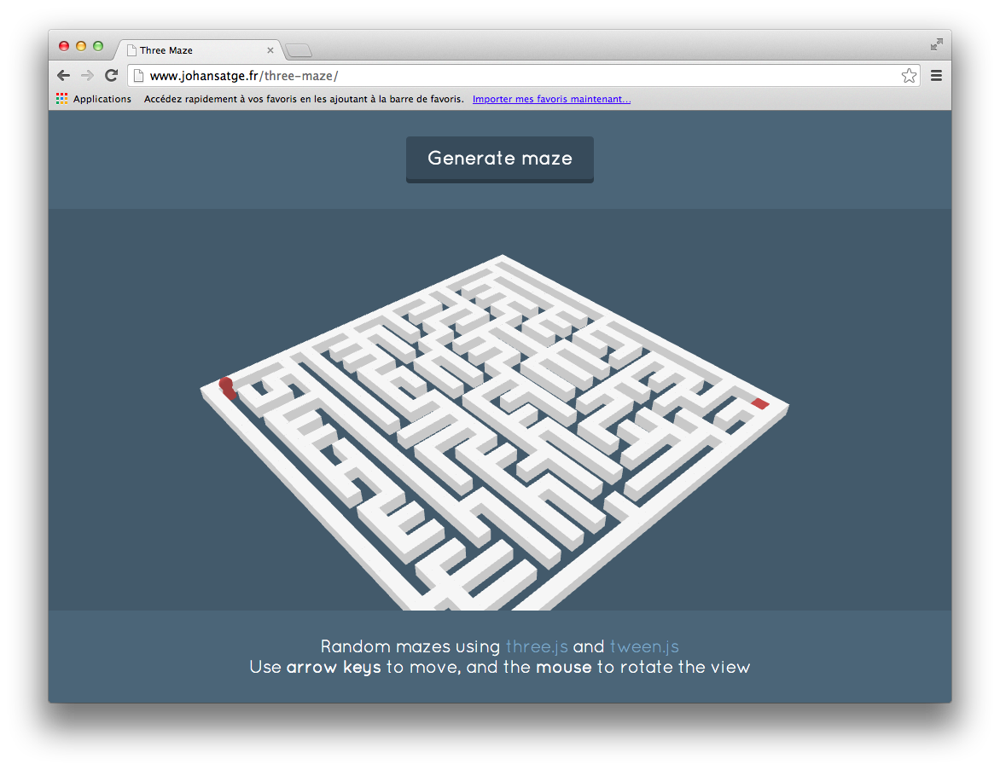

Creation of random 3D mazes with [three.js](http://threejs.org/) and [tween.js](https://github.com/sole/tween.js/) - **[View demo](http://johansatge.github.io/three-maze/)**.

---

## License

This project is released under the [MIT License](LICENSE).

## Credits

* [three.js](http://threejs.org/)
* [tween.js](http://github.com/sole/tween.js)
* [Roguebasin](http://www.roguebasin.com/index.php?title=Simple_maze#Maze_Generator_in_Javascript) (maze generation)
